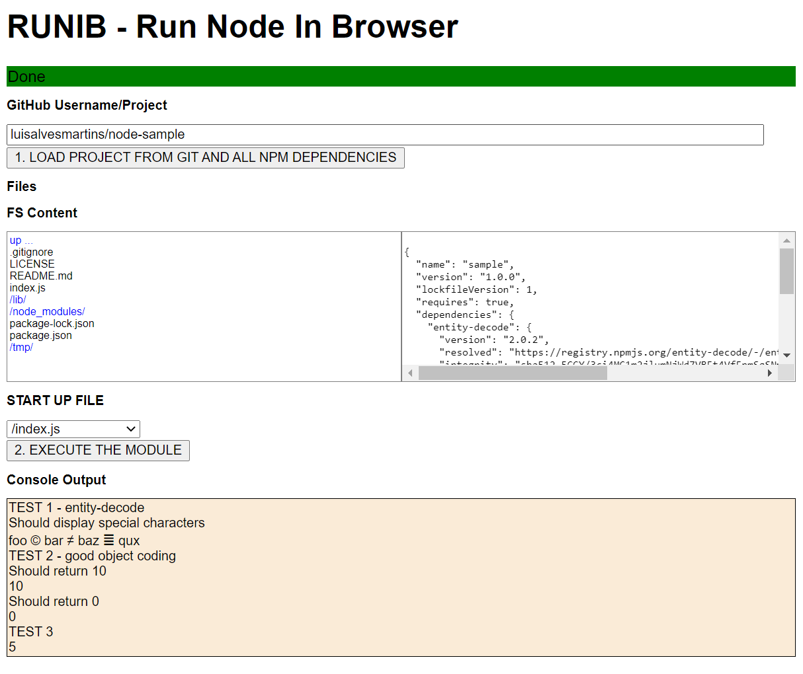

# Run-Node-in-Browser
Run Node server project on Browser

Download the Node project from GitHub to the browser, harvest all the dependencies and run the application in the browser.

No server infrastructure needed.




### Requirements

- Package.json file present in the project
- No HTTP project (for now)


### Execution

- User selects a Github repo
- The page download all the Github files
- Harvest package.json
- Download all the dependencies (equivalent to a NPM install)
- User selects the JS file to run 


### Instalation

- Copy the source code
- run 
    ```
    node index.js
    ```
- open http://localhost:8080


### This solution requires a node server to run?

The page is served from a node server to perform two tasks:
- Act as proxy to NPM
- Expand the NPM modules from tar.gz to open content

No other code is executed or run thru the server. 


### Libs

[nodebowl](https://github.com/sfranzyshen/nodebowl-1)

[memfs](https://github.com/streamich/memfs)

[untar-memory](https://github.com/queckezz/untar-memory)
